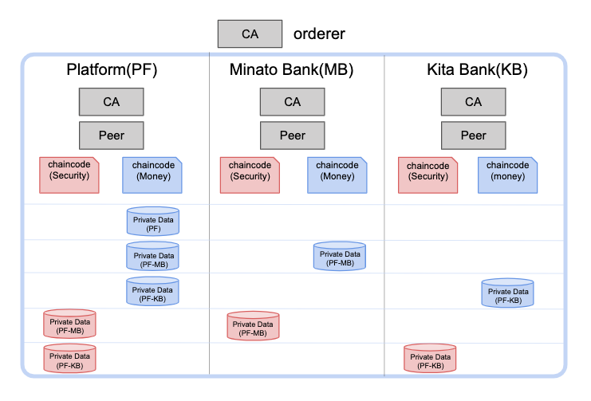

# Hyperledger Fabricによる証券発行のDvP決済実装

## 概要
本リポジトリはHyperledger Fabricを用いて証券発行のDvP決済を実装したものです。  
証券(Security)と資金(Money)のDvP決済を行えるプラットフォームを想定して作成しています。  
証券発行のDvP決済に必要な組織(Organization)やネットワーク設定、Chaincodeが含まれています。  
Dockerがインストールされている環境であれば簡単にネットワーク構築が行え、証券発行のDvP決済のChaincodeの動作確認・アレンジも可能です。  

また、HyperLedger Fabricの下記の要素を利用し、本プロジェクトが想定している証券発行のDvP決済プラットフォームの組織や秘匿性の要件を満たすように実装されています。  
- ネットワーク構築
  - OrdererやCA、組織などを１から設定しながらネットワーク構築処理を行うためHyperledger Fabricのネットワーク構築に必要な設定や処理について理解することができます。
- 新しい組織の追加
  - すでに形成されているネットワークにスクリプトを用いて新しい組織を設定・追加することができます。
- Chaincodeの作成・インストール・アップグレード
  - Hyperledger FabricのスマートコントラクトであるChaincodeはGoで書かれています。リポジトリにはChaincodeのインストールからアップグレードを行うスクリプトが含まれます。
- Private Dataによる残高秘匿化
  - Hyperledger Fabricの秘匿化機能であるPrivate Dataを本プロジェクトが想定する証券発行のDvP決済プラットフォーム上の証券及び資金の残高秘匿化に利用しています。また、デモ用のスクリプトが含まれ、実際に秘匿化ができているか検証することができます。


本プロジェクトでは下記の要素は利用していません。
- SDK
- Event

## 構成
### 本プロジェクトのシナリオについて
本プロジェクトのシナリオは、Fabricの[公式サンプル](https://hyperledger-fabric.readthedocs.io/en/release-1.4/tutorial/commercial_paper.html)のシナリオに資金を追加するようなアレンジを行ったものです。  

証券を発行し、それを投資家が購入する簡単な証券発行のDvP決済です(DvPについては[こちら](https://www.boj.or.jp/announcements/education/oshiete/kess/i17.htm/)をご参照ください)。  
取引のatomic性を保つために同じChannelでモノとカネのAtomicな交換を行い、Private Dataを用いて秘匿化を担保するという設計になっています。例えば、AとBがモノとカネのAtomicな交換が行った後に、Cがそのデータを参照しようとしても参照できません。また、BとCがモノとカネのAtomicな交換が行った後に、Aがそのデータを参照することはできません。

構築するネットワークには下記の4つの組織で構成されています。
1. `Orderer`  
Orderer固有の役割を担いつつネットワークに新しい組織の追加を行います。
2. `Platform`  
この証券発行のDvP決済を管理する組織です。新しく追加された組織をChannelに追加します。また、この組織には発行体がいて、証券の発行を行います。
3. `Minato Bank`
4. `Kita Bank`  
3と4の組織は各投資家が属している組織です。こちらの組織の投資家が発行された証券を購入することになります。




### ディレクトリ構成
本プロジェクトの構成について簡単に説明します(いますぐ動かしてみたい方はこちらはスキップし、下の
Quick Startに進めてもらっても構いません)。  
本プロジェクトは下記のようなシンプルな構成になっています。
```
.
├── chaincodes/
├── config/
├── scripts/
├── docker-compose.yaml
├── README.md
└── .env.template
```
1. `chaincodes`  
本プロジェクトで使われるChaincodeが格納されています。こちらのChaincodeを用いてDEMOの動作を確認します(下の「本プロジェクトのDemoについて」を参照)
2. `configs`  
ネットワーク構築時に必要な各種設定ファイルが格納されています。
3. `scripts`  
ネットワーク構築に必要な処理やChaincodeを動かすためのスクリプトファイルなどが格納されています。
4. `docker-compose.yaml`  
本プロジェクトでネットワーク構築に必要なOrdererや各組織のPeerなど定義されています。
5. `.env.template`  
ネットワークを構築する際に必要な各パラメータなどが定義されています(実際に使用するときは.envにしてください)。

## Quick Start
### 前提条件
本プロジェクトは下記のツールが必須となっています。インストールされていない場合、事前にインストールしてください。
- Docker(ネットワークはDocker上で動作する)

#### 1. 本プロジェクトのリポジトリをgit clone
```
$ git clone https://github.com/LayerXcom/matilda.git
$ cd matilda
```

#### 2. Docker Imageをダウンロード
本プロジェクトはHyperledger Fabricのバージョン1.4系で作成されています。  
下記のコマンドを実行し、Docker imageをダウンロードします。
```
$ ./scripts/download_docker_images.sh 1.4.6 1.4.6 0.4.18
```

#### 3. .envをコピー
```
$ cp .env.template .env
```

#### 4. 起動
ネットワーク構築スクリプトを実行します。そうするとOrdererの設定からコンソーシアム・channel設定、参加する組織の設定、Chaincodeのインストールなどが行われます。構築処理が成功したら`All GOOD, start execution completed`のログが出ます。
```
$ ./scripts/start.sh
```

#### 5. 停止
ネットワーク停止スクリプトを実行します。そうすると起動中のDockerコンテナが停止され、新しく作成されたChaincodeのイメージを全部削除します。
```
$ ./scripts/stop.sh
```

#### 6. Chaincodeアップグレード
Chaincodeをアップグレードすることができます。  
Chaincodeを修正し、下記のコマンドを実行します。コマンドを実行する際に、インストール済みのChaincodeのバージョンより新しいバージョンを指定してください(デフォルトだと1)
```
$ ./scripts/upgrade_securityManager.sh 1.1
```

## 本プロジェクトのDemoについて
### 概要
本プロジェクトのChaincodeは上記で説明した4つの組織で形成されてるネットワークの中で証券発行のDvP決済を行います。
証券発行のDvP決済は下記のシナリオで行います。

### 登場人物
1. `発行体`  
Platform組織に属しており、証券の発行を行う人
2. `投資家`  
発行体が発行した証券を購入する人(Minato Bankの投資家)
3. `Kita Bank`  
Private Data検証のためMinato Bankの投資家が購入した証券と残高を確認しようとする組織

### シナリオ
1. 初期設定として、発行体(layerx)とMinato Bankの各投資家(investor1, investor02, investor03)の口座(お金)にお金を入金する
2. 発行体が証券発行を行う
3. Minato Bankの投資家(investor01, investor02, investor03)は証券購入量の登録を行う
4. 発行体が証券の発行を行うと証券購入量情報を基にお金と証券の同時交換が行われる
5. 各投資家の証券残高を確認する
6. 発行体と各投資家のお金の残高を確認する
7. kitabankでinvestor01のお金残高を確認する

### 動作確認
上記のシナリオを下記のコマンドを実行することで確認することができます。  
```
$ ./scripts/demo/init.sh
```
実行結果
```
=========== investor01 identity登録 ===========
2020/04/21 10:46:44 [INFO] Configuration file location: /root/.fabric-ca-client/fabric-ca-client-config.yaml
Password: password
2020/04/21 10:46:44 [INFO] Created a default configuration file at /root/.fabric-ca-client/fabric-ca-client-config.yaml
2020/04/21 10:46:44 [INFO] generating key: &{A:ecdsa S:256}
2020/04/21 10:46:44 [INFO] encoded CSR
2020/04/21 10:46:44 [INFO] Stored client certificate at /etc/hyperledger/fabric/mspdir/minatobank/msp/identities/investor01/signcerts/cert.pem
2020/04/21 10:46:44 [INFO] Stored root CA certificate at /etc/hyperledger/fabric/mspdir/minatobank/msp/identities/investor01/cacerts/minatobank-ca-7064.pem
2020/04/21 10:46:44 [INFO] Stored Issuer public key at /etc/hyperledger/fabric/mspdir/minatobank/msp/identities/investor01/IssuerPublicKey
2020/04/21 10:46:44 [INFO] Stored Issuer revocation public key at /etc/hyperledger/fabric/mspdir/minatobank/msp/identities/investor01/IssuerRevocationPublicKey

=========== investor02 identity登録 ===========
2020/04/21 10:46:45 [INFO] Configuration file location: /root/.fabric-ca-client/fabric-ca-client-config.yaml
Password: password
2020/04/21 10:46:46 [INFO] Created a default configuration file at /root/.fabric-ca-client/fabric-ca-client-config.yaml
2020/04/21 10:46:46 [INFO] generating key: &{A:ecdsa S:256}
2020/04/21 10:46:46 [INFO] encoded CSR
2020/04/21 10:46:46 [INFO] Stored client certificate at /etc/hyperledger/fabric/mspdir/minatobank/msp/identities/investor02/signcerts/cert.pem
2020/04/21 10:46:46 [INFO] Stored root CA certificate at /etc/hyperledger/fabric/mspdir/minatobank/msp/identities/investor02/cacerts/minatobank-ca-7064.pem
2020/04/21 10:46:46 [INFO] Stored Issuer public key at /etc/hyperledger/fabric/mspdir/minatobank/msp/identities/investor02/IssuerPublicKey
2020/04/21 10:46:46 [INFO] Stored Issuer revocation public key at /etc/hyperledger/fabric/mspdir/minatobank/msp/identities/investor02/IssuerRevocationPublicKey

=========== investor03 identity登録 ===========
2020/04/21 10:46:47 [INFO] Configuration file location: /root/.fabric-ca-client/fabric-ca-client-config.yaml
Password: password
2020/04/21 10:46:47 [INFO] Created a default configuration file at /root/.fabric-ca-client/fabric-ca-client-config.yaml
2020/04/21 10:46:47 [INFO] generating key: &{A:ecdsa S:256}
2020/04/21 10:46:47 [INFO] encoded CSR
2020/04/21 10:46:47 [INFO] Stored client certificate at /etc/hyperledger/fabric/mspdir/minatobank/msp/identities/investor03/signcerts/cert.pem
2020/04/21 10:46:47 [INFO] Stored root CA certificate at /etc/hyperledger/fabric/mspdir/minatobank/msp/identities/investor03/cacerts/minatobank-ca-7064.pem
2020/04/21 10:46:47 [INFO] Stored Issuer public key at /etc/hyperledger/fabric/mspdir/minatobank/msp/identities/investor03/IssuerPublicKey
2020/04/21 10:46:47 [INFO] Stored Issuer revocation public key at /etc/hyperledger/fabric/mspdir/minatobank/msp/identities/investor03/IssuerRevocationPublicKey

=========== layerxの口座初期設定(0) ===========
2020-04-21 10:46:48.847 UTC [chaincodeCmd] InitCmdFactory -> INFO 001 Retrieved channel (all-ch) orderer endpoint: orderer:7050
2020-04-21 10:46:48.860 UTC [chaincodeCmd] chaincodeInvokeOrQuery -> INFO 002 Chaincode invoke successful. result: status:200 payload:"0"

=========== investor01の口座初期設定(100000000000) ===========
2020-04-21 10:46:49.946 UTC [chaincodeCmd] InitCmdFactory -> INFO 001 Retrieved channel (all-ch) orderer endpoint: orderer:7050
2020-04-21 10:46:49.957 UTC [chaincodeCmd] chaincodeInvokeOrQuery -> INFO 002 Chaincode invoke successful. result: status:200 payload:"100000000000"

=========== investor02の口座初期設定(100000000000) ===========
2020-04-21 10:46:51.207 UTC [chaincodeCmd] InitCmdFactory -> INFO 001 Retrieved channel (all-ch) orderer endpoint: orderer:7050
2020-04-21 10:46:51.218 UTC [chaincodeCmd] chaincodeInvokeOrQuery -> INFO 002 Chaincode invoke successful. result: status:200 payload:"100000000000"

=========== investor03の口座初期設定(200000000000) ===========
2020-04-21 10:46:52.354 UTC [chaincodeCmd] InitCmdFactory -> INFO 001 Retrieved channel (all-ch) orderer endpoint: orderer:7050
2020-04-21 10:46:52.364 UTC [chaincodeCmd] chaincodeInvokeOrQuery -> INFO 002 Chaincode invoke successful. result: status:200 payload:"200000000000"
```
1. 発行体が証券発行を行う
2. 投資家(investor1, 2, 3)たちは証券購入量の登録を行う
```
$ ./scripts/demo/create_security.sh
```
実行結果
```
=========== 証券登録(発行数: 100, １口当たり価格: 10000) ===========
2020-04-21 10:47:01.745 UTC [chaincodeCmd] InitCmdFactory -> INFO 001 Retrieved channel (all-ch) orderer endpoint: orderer:7050
2020-04-21 10:47:14.464 UTC [chaincodeCmd] chaincodeInvokeOrQuery -> INFO 002 Chaincode invoke successful. result: status:200 payload:"{\"name\":\"OneMilionSecurity\",\"issuer\":\"layerx\",\"units\":\"100\",\"price\":\"10000\",\"Status\":0}"

=========== 証券一覧取得 ===========
2020-04-21 10:47:16.694 UTC [chaincodeCmd] InitCmdFactory -> INFO 001 Retrieved channel (all-ch) orderer endpoint: orderer:7050
2020-04-21 10:47:16.710 UTC [chaincodeCmd] chaincodeInvokeOrQuery -> INFO 002 Chaincode invoke successful. result: status:200 payload:"[{\"Key\":\"security1\", \"Record\":{\"Status\":0,\"issuer\":\"layerx\",\"name\":\"OneMilionSecurity\",\"price\":\"10000\",\"units\":\"100\"}}]"

=========== investor01の証券購入量を登録(40) ===========
2020-04-21 10:47:18.971 UTC [chaincodeCmd] InitCmdFactory -> INFO 001 Retrieved channel (all-ch) orderer endpoint: orderer:7050
2020-04-21 10:47:18.980 UTC [chaincodeCmd] chaincodeInvokeOrQuery -> INFO 002 Chaincode invoke successful. result: status:200 payload:"{\"Units\":40,\"IsTransferred\":false}"

=========== investor02の証券購入量を登録(50) ===========
2020-04-21 10:47:20.137 UTC [chaincodeCmd] InitCmdFactory -> INFO 001 Retrieved channel (all-ch) orderer endpoint: orderer:7050
2020-04-21 10:47:20.144 UTC [chaincodeCmd] chaincodeInvokeOrQuery -> INFO 002 Chaincode invoke successful. result: status:200 payload:"{\"Units\":50,\"IsTransferred\":false}"

=========== investor03の証券購入量を登録(10) ===========
2020-04-21 10:47:21.355 UTC [chaincodeCmd] InitCmdFactory -> INFO 001 Retrieved channel (all-ch) orderer endpoint: orderer:7050
2020-04-21 10:47:21.360 UTC [chaincodeCmd] chaincodeInvokeOrQuery -> INFO 002 Chaincode invoke successful. result: status:200 payload:"{\"Units\":10,\"IsTransferred\":false}"
```

3. 発行体が証券の発行を行うと証券購入量情報を基にお金と証券のAtomicな交換が行われる
```
$ ./scripts/demo/issue.sh
```
実行結果
```
=========== 証券発行 ===========
2020-04-21 10:47:28.633 UTC [chaincodeCmd] InitCmdFactory -> INFO 001 Retrieved channel (all-ch) orderer endpoint: orderer:7050
2020-04-21 10:47:28.643 UTC [chaincodeCmd] chaincodeInvokeOrQuery -> INFO 002 Chaincode invoke successful. result: status:200 payload:"{\"name\":\"OneMilionSecurity\",\"issuer\":\"layerx\",\"units\":\"100\",\"price\":\"10000\",\"Status\":2}"

=========== モノとカネのAtomicな交換 ===========
2020-04-21 10:47:30.772 UTC [chaincodeCmd] InitCmdFactory -> INFO 001 Retrieved channel (all-ch) orderer endpoint: orderer:7050
2020-04-21 10:47:30.853 UTC [chaincodeCmd] chaincodeInvokeOrQuery -> INFO 002 Chaincode invoke successful. result: status:200
```

4. 各投資家の証券残高を確認する
```
$ ./scripts/demo/get_money_balance.sh
```
実行結果(お金の残高)  
発行体の残高は増えており(証券の発行口数 * １口当たり価格)、各投資家の残高は減っていることがわかります。
```
=========== layerxのお金残高 ===========
2020-04-21 10:47:47.129 UTC [chaincodeCmd] InitCmdFactory -> INFO 001 Retrieved channel (all-ch) orderer endpoint: orderer:7050
2020-04-21 10:47:47.142 UTC [chaincodeCmd] chaincodeInvokeOrQuery -> INFO 002 Chaincode invoke successful. result: status:200 payload:"1000000"

=========== investor01のお金残高 ===========
2020-04-21 10:47:48.361 UTC [chaincodeCmd] InitCmdFactory -> INFO 001 Retrieved channel (all-ch) orderer endpoint: orderer:7050
2020-04-21 10:48:00.836 UTC [chaincodeCmd] chaincodeInvokeOrQuery -> INFO 002 Chaincode invoke successful. result: status:200 payload:"99999600000"

=========== investor02のお金残高 ===========
2020-04-21 10:48:02.038 UTC [chaincodeCmd] InitCmdFactory -> INFO 001 Retrieved channel (all-ch) orderer endpoint: orderer:7050
2020-04-21 10:48:02.052 UTC [chaincodeCmd] chaincodeInvokeOrQuery -> INFO 002 Chaincode invoke successful. result: status:200 payload:"99999500000"

=========== investor03のお金残高 ===========
2020-04-21 10:48:03.235 UTC [chaincodeCmd] InitCmdFactory -> INFO 001 Retrieved channel (all-ch) orderer endpoint: orderer:7050
2020-04-21 10:48:03.252 UTC [chaincodeCmd] chaincodeInvokeOrQuery -> INFO 002 Chaincode invoke successful. result: status:200 payload:"199999900000"
```
5. 発行体と各投資家のお金の残高を確認する
```
$ ./scripts/demo/get_security_balance.sh
```
実行結果(証券残高)
```
=========== investor01の証券残高 ===========
2020-04-21 10:48:14.457 UTC [chaincodeCmd] InitCmdFactory -> INFO 001 Retrieved channel (all-ch) orderer endpoint: orderer:7050
2020-04-21 10:48:14.474 UTC [chaincodeCmd] chaincodeInvokeOrQuery -> INFO 002 Chaincode invoke successful. result: status:200 payload:"40"

=========== investor02の証券残高 ===========
2020-04-21 10:48:15.585 UTC [chaincodeCmd] InitCmdFactory -> INFO 001 Retrieved channel (all-ch) orderer endpoint: orderer:7050
2020-04-21 10:48:15.602 UTC [chaincodeCmd] chaincodeInvokeOrQuery -> INFO 002 Chaincode invoke successful. result: status:200 payload:"50"

=========== investor03の証券残高 ===========
2020-04-21 10:48:16.763 UTC [chaincodeCmd] InitCmdFactory -> INFO 001 Retrieved channel (all-ch) orderer endpoint: orderer:7050
2020-04-21 10:48:16.780 UTC [chaincodeCmd] chaincodeInvokeOrQuery -> INFO 002 Chaincode invoke successful. result: status:200 payload:"10"
```
6. kitabankでinvestor01のお金残高を確認する
```
$ ./scripts/demo/get_money_balance_as_kitabank.sh
```
実行結果
```
=========== kitabankからinvestor01のお金残高を確認 ===========
Starting matilda_kitabank-couchdb_1 ... done
2020-04-21 11:34:08.035 UTC [chaincodeCmd] InitCmdFactory -> INFO 001 Retrieved channel (all-ch) orderer endpoint: orderer:7050
2020-04-21 11:34:20.337 UTC [chaincodeCmd] chaincodeInvokeOrQuery -> INFO 002 Chaincode invoke successful. result: status:200
```
ログをみると処理が正常に完了しているように見えますが、kitabank-peer1のログをみてみると

kitabank-peer1のログ確認
```
$ docker-compose logs -f kitabank-peer1
```
下記のようにkitabankはinvestor01のデータにアクセスできないことがわかります。
```
. . . 
kitabank-peer1_1      | 2020-04-21 11:34:20.330 UTC [chaincode] HandleTransaction -> ERRO 0c3 [ba8702f9] Failed to handle GET_STATE. error: tx creator does not have read access permission on privatedata in chaincodeName:money collectionName: MinatoBankMoneyBalance
. . .
```


## Licence
Apache License, Version 2.0 ([Apache-2.0](/LICENSE))
